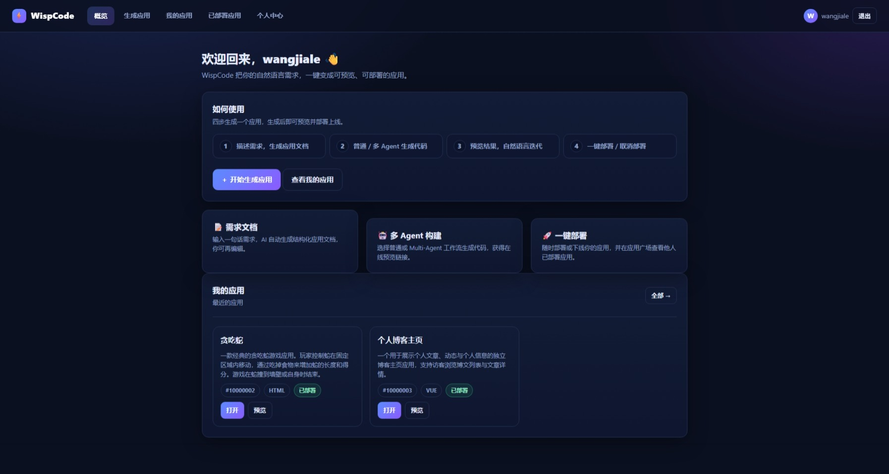
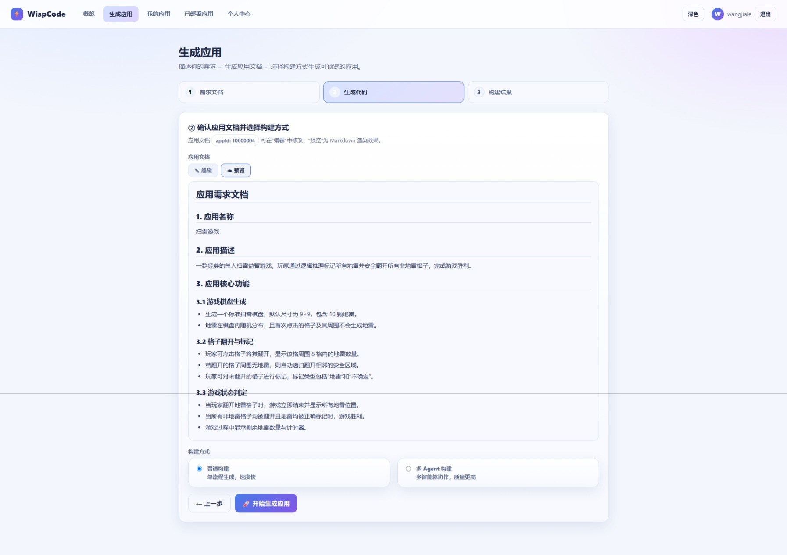
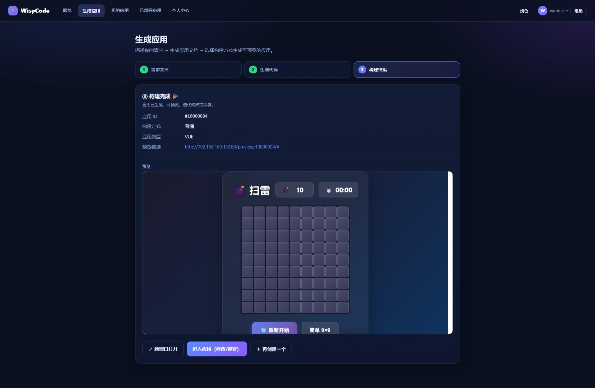
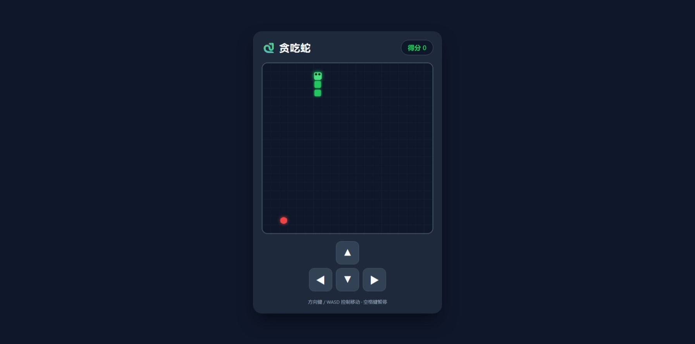
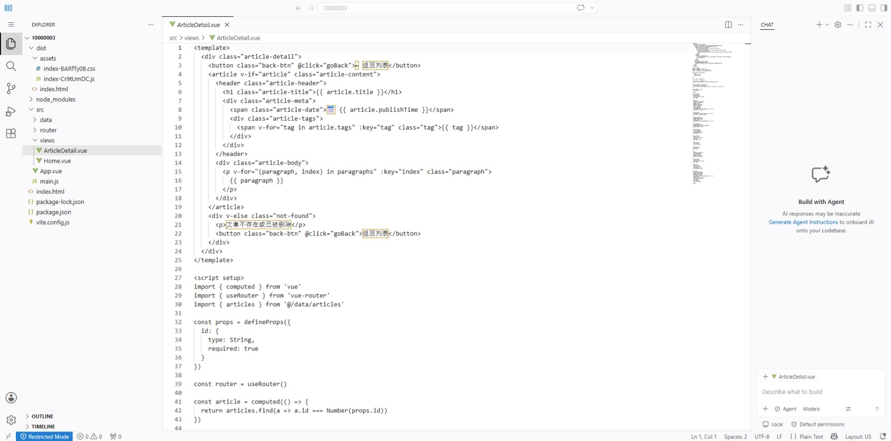

<p align="center">
  
</p>
## 一、技术栈

1. SpringBoot、SpringAI、SpringCloud、MyBatis-Plus 等

2. 中间件或小组件：Git、Docker、Redis、MySQL、Nacos、Nginx、Milvus 等

## 二、功能介绍

### 2.1 根据自然语言描述生成应用

1. 用户不需要考虑到需求文档的层次，只需要给出最基本的需求，比如：做一个贪吃蛇、写一个个人博客页面，LLM 会自动根据用户需求生成软件需求

2. 支持三种类型应用，HTML、VUE、Spring_VUE（前后端结合）

3. 应用构建，分为两种方式：

	* 单 Agent 完成代码编写、编译构建、构建预览、代码上传

	* 多 Agent 构建 Graph，在单 Agent 分别负责上述任务之外，增加编译报错修复节点

<p align="center">
  
</p>
<p align="center">
  
</p>

### 2.2 LLM 生成应用实时预览

后端会自动完成代码的编译构建，返回预览 URL，前端直接点击跳转即可直接浏览前端效果，并与后端（存在的话）进行交互

<p align="center">
  
</p>

### 2.3 对 LLM 生成的应用进行修改

1. 对于普通用户，提供直接通过自然语言重新要求 LLM 对代码进行修改的选项

2. 对于高级开发者，通过 Code Server 容器，提供代码类桌面端 VSCode 的代码编辑体验（CodeOSS ，无 MicroSoft 插件市场）

<p align="center">
  
</p>

> 目前，出于权限限制考虑，使用 Code Server 容器动态创建，并且只挂载宿主机用来预览的代码的目录。

### 2.4 基于 Gitee API  进行云端代码存储

最初设计实现为 MCP，后续发现直接封装为方法可实现相同效果，并且不会受模型输出导致 ToolCalling 异常。提供下面三个方法

* commit，模拟 `git commit`，不存在新增，存在则更新

* pull，将云端代码拉取到本地

* delete，删除云端代码

### 2.5 RAG

* 向量数据库，使用 Docker 部署 Milvus，默认使用 BAAI/bge-m3 作为嵌入模型

* 在开发过程中发现相关内容通过 LLM 的系统提示词更加适合传递，故目前只是搭建了 RAG 系统，并未直接提供作为检索资料的语料。如果需要，直接添加文本内容即可

### 2.6 应用论坛

用户可以将自己构建的应用进行部署，供所有用户查看

### 2.7 登录系统

通过邮件验证码进行用户注册、登录

### 2.8 其他功能

1. 前端页面主题切换

2. 使用 JWT Token + Redis 完成登录态处理

## 三、部署
### 3.1 部署代码

nginx 配置，将 `nginx/conf/nginx.conf` 中的 IP 更新

`clone` 本仓库到 `/home/diinki/` 目录下，找到 `deploy/test/app/docker-compose-mid.yml`，通过下面的命令进行容器编排

```shell
$ docker compose -p nexus-stack -f docker-compose-mid.yml up -d
```

部署了以下容器

* `Redis`，映射主机 5379 端口，默认认证密码：`bite@123`，容器名：`frameworkjava-redis`

* `MySQL`，映射主机 3306 端口，默认用户：`bitedev`，密码：`bite@123` （MYSQL_ROOT_PASSWORD=bite@123）

* `Nacos`，映射主机 8848、9848 端口，默认用户 `nacos`，密码 `bite@123`

* `Milvus`，向量数据库。默认用户 `root`，默认密码 `minioadmin`，WebUI 访问 `http://localhost:9091/webui`，或者通过 Attu 客户端。创建数据库 `wispcode_db`；创建 Collection `RAG`（对应表），设置下面的字段：

	* doc_id，主键，VarChar(36)

	* content，VarChar(65535)

	* metadata，JSON

	* embedding，1024 维的向量，对应到 BAAI/bge-m3 输出向量

* `bge-m3-embedding`，因为网络环境原因，直接从 HuggingFace 获取嵌入模型不稳定，所以通过 model_downlaod.py 下载，容器编排自动完成挂载，容器位置位于 `/data`

* `wispcode-userapp-preview`，预览容器，包含 nginx + JDK

### 3.2 准备后续所需镜像

1. `codercom/code-server:4.137.0`，用于后续为用户提供网页端 Code 代码修改

2. 制作容器，主要后端服务容器需要提供 jdk、npm、mvn，没有现成的镜像，手动制作（虽然也上传了 DockerHub，但是考虑网络环境，选取自行制作。直接仓库拉取：`docker pull wangjialelele/jdk21-mvn-npm:v1.0`

### 3.3 配置 Nacos 配置

打开 Nacos 浏览器管理界面，更改如下配置：

* `share-wispcode-test.yaml`，更改 API-KEY，以及嵌入模型服务器、向量数据库、预览容器、docker 服务器、code-server 容器的 IP 地址，Gitee Access-Token

* `share-mysql-test.yaml`，更改 MySQL 服务器 IP，数据库名称不需更改

* `share-email-test.yaml`，更改邮箱、smtp 密码

### 3.4 后端服务配置更改

#### 3.4.2 Docker Server IP

后端服务使用 Docker Maven Plugin 进行服务打包部署，在根 pom.xml 中，修改 Docker Server IP

#### 3.4.3 Nacos Server

同样在根 pom.xml 中更新 Nacos Server IP

#### 3.5 Docker 远程访问证书

1. 运行 deploy/app/config/cert 下的 cert.sh（root权限，并且修改 SERVER 地址；同时，建议使用 file 查看是否含有 Windows 换行符，如果有，使用 dos2unix 修改）  
  
    生成如下文件    
    `ca-key.pem`： CA密钥  
    `ca.pem`：CA证书  
    `cert.pem`： 客户端证书  
    `extfile.cnf`： 客户端证书扩展配置文件  
    `key.pem`： 客户端密钥  
    `server-cert.pem`： 服务端证书  
    `server-key.pem`： 服务端密钥  
  
2. 其中，`ca.pem`、`server-cert.pem`、`server-key.pem` 放到 `/etc/docker`；将 `ca.pem`、`cert.pem`、`key.pem` 放到 `wisp-code/deploy/test/app/config/cert` 目录下（`cert.sh` 同级目录）  
  
    将 `/lib/systemd/system/docker.service` 中的相应部分替换  
    `ExecStart=/usr/bin/dockerd -H tcp://0.0.0.0:2376 --tlsverify=true --tlscacert=/etc/docker/ca.pem --tlscert=/etc/docker/server-cert.pem --tlskey=/etc/docker/server-key.pem -H fd:// --containerd=/run/containerd/containerd.sock`
    随后重启 docker 服务（`daemon-reload`，`restart`）  
